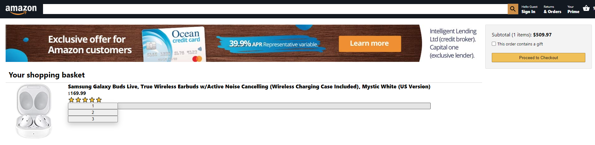

# Important Tools

- Routing component from 'react-router'
- Link component from 'react-router-dom'
- React Context API
- Array.prototype:
  - fill()
  - map()
  - reduce()
- material-ui and material-ui/icons

# Helpful links for the product quantity drop down menu

- w3schools css dropdown menu: https://www.w3schools.com/css/css_dropdowns.asp
- State Hook with function components: https://reactjs.org/docs/hooks-state.html

# Images

### Homepage

### Checkout Page

### Dropdown Menu

